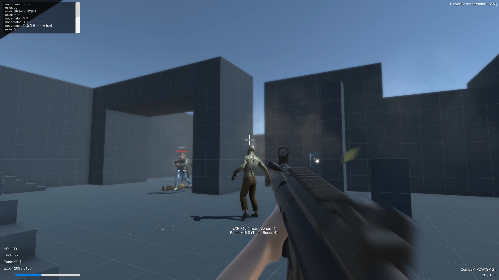

# Unity Zombie FPS Co-op Examples
Multiplayer version of [Unity Zombie Defence FPS Example](https://github.com/rico345100/unity-zombie-defence-fps-example).

## Screenshots

## Fixed Bugs (17.08.13)
- Game Over occurs even some of player still alive.
- Can't rotate screen after try to chat in Inspector mode.
- Zombies were didn't sync properly.
- Refund money when revives
- Freezing issue when player dies
- Respawn protection didn't worked

## About resources (License)
You can use any script in this game, but don't use blood effect and weapon models.
Blood Effect is sales on Unity Asset Store, and it's not my resource so you could have disadvantage or might be subject to legal regulations.
Weapon models are from [https://www.cgtrader.com/](https://www.cgtrader.com/), I used free models but I'm not sure they can use for commercial purpose.

I'm strongly recommend that just learn how this game works, not gonna use the resources.
I'm not responsible of those personal un-licensed uses!

## Patch Note
- Refund money rate when revives increased to 70% -> 90%
- Give extra respawn bonus (100 * Player numbers in the game)
- Reduce cost of some weapons (Especially high tier weapons)
- Reduce cost of ammunition of some weapons
- Reduce heal cost (200 + (UsedCount * 100) => 100 + (UsedCount * 75))
- Increase respawn protection duration to 20 seconds.
- Reduce cost of resurrection(100 + increase by time => 100 Fixed)

## Features
- Max 4 players in single server(room)
- 6 Weapons & 7 Upgrades
- User Authentication & Permanent User info saving via Server
- Chat System
- Inspector

## Requirements
- Must run [Score Server](https://github.com/rico345100/unity-zombie-defense-fps-multiplayer-score-server) before game starts. If you didn't, you can't start game. You just stuck in login interface.

## How to run
1. You need public [score server](https://github.com/rico345100/unity-zombie-defense-fps-multiplayer-score-server) and it must be run before game starts.
2. You need Photon's AppID and ChatAppID. Put in them to "/Assets/Photon Unity Networking/Resources/PhotonServerSettings".
3. Select your closest region. It's just recommendation. I live in South Korea, so I used "Kr" region.
4. Change URL that Http requests.
5. Run!

## Control - Alive
- WASD: Basic movements
- R: Reloading
- M1: Fire
- M2: Aiming
- L-Shift: Sprinting
- T: Using chat

## Control - Inspector
- WASD: Movements
- Space: Floating up
- Ctrl: Floating down

## Rules
- You will spawn with Police 9mm pistol.
- After 15 seconds that game began, Zombies will spawn some spots.
- Kill the zombies to gain experience and cash.
- Upgrade your weapons or buy new gun with that cash.
- It's endless survival game. Zombies will getting stronger and stronger, also gives more funds and exps.

## Weapons
- Police 9mm: Police 9mm is standard police sidearm. It has 15 ammo capacity, low recoil, fast reload speed with cheapest upgrade/ammunition cost.
- Compakt PDW: Compakt PDW is cheapest primary weapon in this game. It has 25 ammo capacity with lowest damage per bullet, but also has fastest fire rate in this game.
- Portable Magnum: Portable Magnum is a powerful sidearm that can kill zombies with single headshot with proper damage upgrade. But becareful, it's ammunition is expensive and don't gives much ammo to use. Aim the head!
- Auto 45: Auto 45 is a primary submachinegun that fires .45 ACP calibers. It's little bit slower than Compakt PDW, but it has much higher damage to kill zombies within 3~4 headshots with proper damage upgrade.
- Defender Shotgun: Defender Shotgun has most powerful damage with close distance, with single shot. It fires 8 pellets per single shot, and these bullets will penetrate enemy if it's dead. But it has slowest fire rate of this game, and also reloading speed is slow. Don't forget to make distance to kill zombies at one shot, but not gonna hit by them.
- Stov Rifle: Stov Rifle has highest DPS in this Game. It's military assault rifle that fires 7.62mm catridge with full-automatic. It has really high recoil and has slow reload speed, but it has magnificent fire power. You can kill the zombies with 2~3 headshots with proper damage upgrade.

## Upgrades
- Damage Boost: Increases damager per bullet
- Faster Reload: Increases reloading speed
- Reduce Recoil: Reduces gun's recoil on fire
- Extend Mag: Extend magazine's ammo capacity
- Max Ammo: Extend max ammo can hold
- More Health: Extend max health, also gives 20 hp immediately right after purchased.
- Regeneration: Activate health regeneration

## Other purchasables
- Ammunition: Refill your current weapon's ammunition. You will receive maximum ammo hold + ammo of 1 magazine capacity. If you upgrade your weapon, ammunition cost will raise.
- Resurrection: Revive every dead player. Respawned player has immune for all attacks in 15 seconds. Also some of fund before player dies will restored(70% total fund will refunded, also every upgrade costs also)

## Bugs & Improvements
Please write the issue on the github page when you found bugs. But I have no plan to improve this game, because this game is just for demonstration.

## See Also
- [Score Server](https://github.com/rico345100/unity-zombie-defense-fps-multiplayer-score-server)
- [Web Scoreboard](https://github.com/rico345100/unity-zombie-defense-fps-multiplayer-scoreboard)
